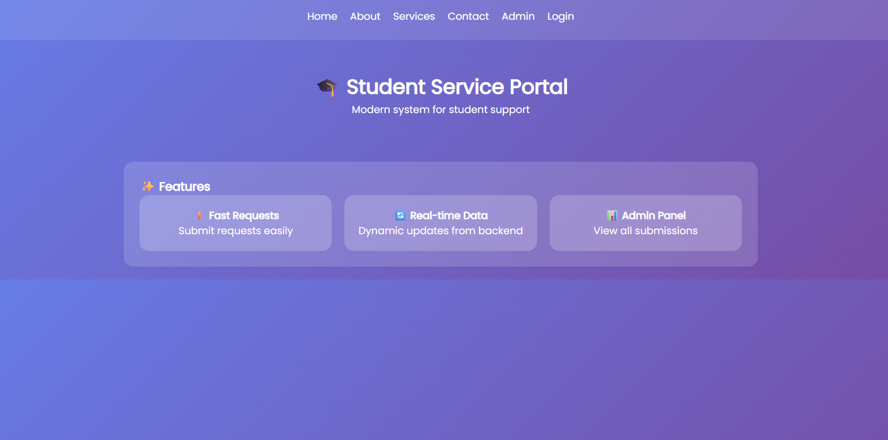
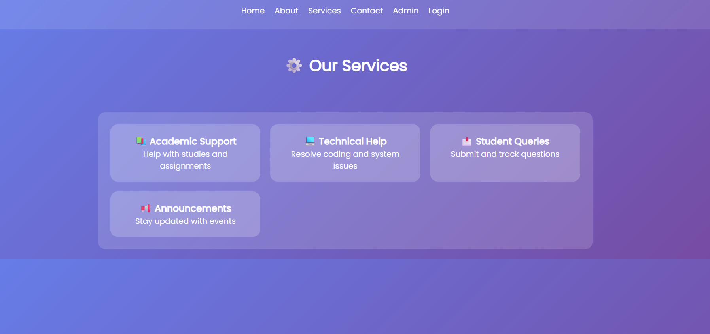
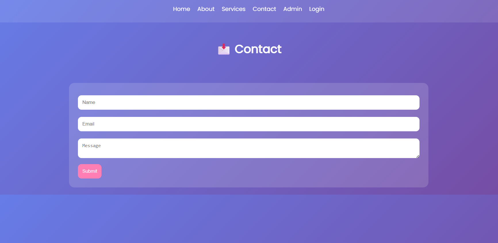
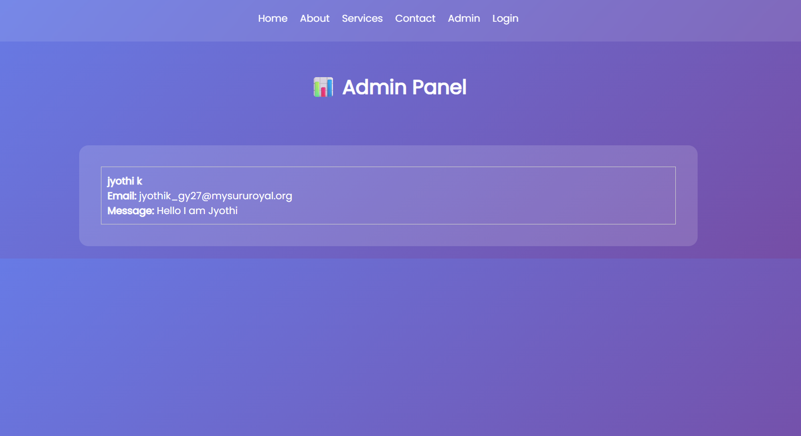
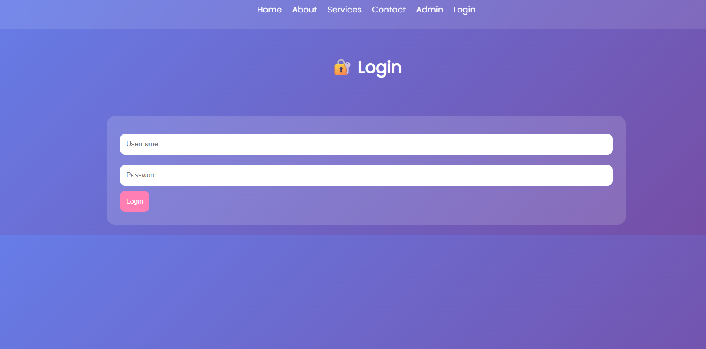

# 🎓 Student Service Portal

## 📌 Project Description

The Student Service Portal is a full-stack web application developed to simulate a real-world system where students can access services, submit requests, and view updates.

This project demonstrates frontend and backend integration, dynamic data handling, and proper Git workflow.

---

## 🚀 Features

* 🏠 Home Page
* 📘 About Page
* ⚙️ Services Page
* 📩 Contact Form (saves data)
* 📊 Admin Dashboard (view submitted data)
* 🔐 Login Page (basic validation)

---

## 🛠️ Tech Stack

**Frontend:**

* HTML
* CSS (Modern UI with responsive design)
* JavaScript

**Backend:**

* Node.js
* Express.js

**Database:**

* JSON file (used for storing and retrieving data)

---

## 🔄 Functionality

* Users can submit data through the Contact Form
* Backend handles POST request and stores data in JSON
* Admin page fetches data using GET request
* Data persists and is displayed dynamically

---

## 🌿 Git Workflow

This project follows a proper branching strategy:

* **development** → All coding work
* **staging** → Testing phase
* **production** → Final version

All branches are maintained and merged properly.

---

## ▶️ How to Run the Project

1. Navigate to backend folder:

   ```
   cd backend
   ```

2. Install dependencies:

   ```
   npm install
   ```

3. Start server:

   ```
   node server.js
   ```

4. Open frontend files in browser

---

## 🔐 Login Credentials

* Username: `admin`
* Password: `1234`

---

## 📸 Screenshots

### 🏠 Home Page



### ⚙️ Services Page



### 📩 Contact Page



### 📊 Admin Page



### 🔐 Login Page



---

## 📌 Conclusion

This project successfully demonstrates:

* Full-stack development
* API handling (GET & POST)
* JSON-based data storage
* Clean and responsive UI
* Proper Git workflow

---

## 👩‍💻 Author

**Jyothi K**
